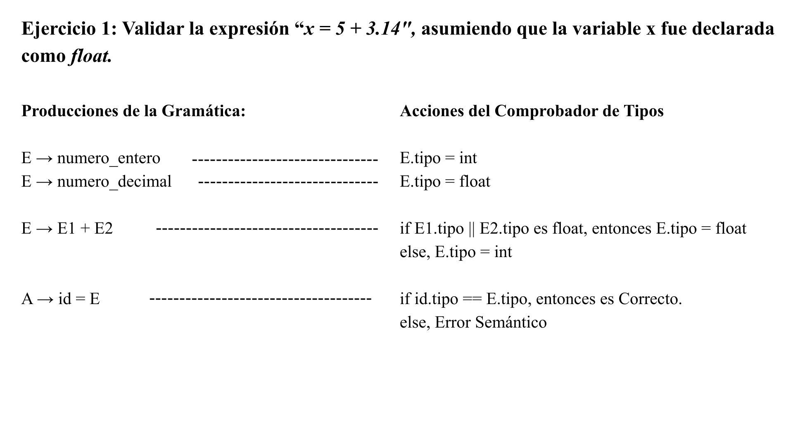
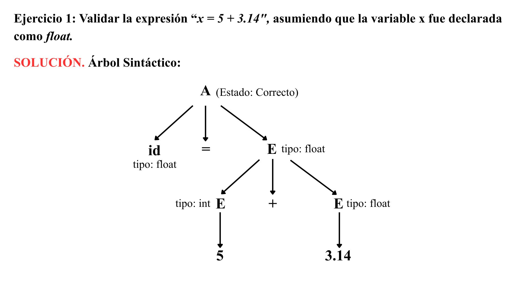

# Introducción
En el marco de la materia de Compiladores y Lenguajes, el estudio detallado de los componentes internos y el análisis de sus aplicaciones en el mundo real son indispensables para entender el impacto de estas herramientas en la sociedad actual. El desarrollo de software, pilar fundamental de la tecnología de los últimos años, depende íntimamente del correcto uso de principios y conceptos de ingeniería en la construcción de los aplicativos que utilizamos a diario. Es por esto, considerando el alcance de este proyecto, es esencial establecer un contexto y una justificación teórica rigurosa y fundamentada respecto a los procesos que se llevan a cabo junto a la compilación. En concreto, para lograr comprender el Análisis Semántico, se discernirán a profundidad temas derivados a este núcleo, como los Sistemas de Tipos, la Comprobación y Conversión de los mismos, así como el papel que estos elementos tienen dentro del proceso de Traducción en general.

El proceso de traducción que sufre un lenguaje de programación de alto nivel a código de máquina es uno de los logros más importantes en la historia de las ciencias de computación, dado que para que se puedan ejecutar las abstracciones escritas por un programador, el código fuente necesita atravesar una gran cantidad de transformaciones. Entre ellas, se encuentra el análisis léxico, encargado de juntar las secuencias de caracteres del código en unidades lógicas con significado para la máquina, a estas unidades lógicas se las conoce como tokens. Siguiendo el flujo de traducción, se encuentra el análisis sintáctico, que construye el Árbol Sintáctico con el objetivo de verificar que la disposición de los tokens sea la correcta y cumpla con las reglas gramaticales definidas por el lenguaje.

Aun así, existen dificultades adicionales, pues el hecho de que un programa fuente sea verificado como gramaticalmente correcto, no quiere decir que tenga el sentido computacional deseado. Por ejemplo, en una sentencia concreta de código donde se compare un tipo de dato String con un tipo de dato Int sigue una estructura de Identificador = Expresión + Constante, que en el sentido gramatical cumple todas las reglas requeridas, sin embargo, desde una perspectiva lógica y técnica, los tipos de datos involucrados en esta operación corresponden a una violación de las reglas computacionales correspondientes, así como la asignación de esta operación ilegal a un identificador, por lo tanto, si se llegase a intentar compilar esta sentencia, llegaríamos a una inevitable falla del sistema e incluso la corrupción de la memoria durante la ejecución. Es en este escenario donde interviene la fase del Análisis Semántico, actuando como el conector y filtro de seguridad definitivo entre la validación estructural del código fuente y la síntesis del mismo.

Entonces, el Análisis Semántico es una fase característica del compilador responsable de verificar las reglas dependientes del lenguaje, enfocándose especialmente en el contexto del lenguaje de programación. Su propósito y principal objetivo es garantizar que el programa fuente no solo esté gramaticalmente correcto, sino también que las instrucciones que se incluyan en el tengan un significado coherente y seguro, acorde a las reglas semánticas del lenguaje, para llegar a este objetivo, el analizador semántico recorre el árbol generado en la fase semántica y se apoya en la Tabla de Símbolos, una de las estructuras de datos más importantes en el proceso de Traducción, ya que sirve de diccionario para el compilador, almacenando los metadatos de cada uno de los identificadores registrados, así como su alcance, su ubicación en memoria y su tipo de dato.

Dentro de esta etapa se realizan muchas otras validaciones, como asegurarse de que las variables hayan sido declaradas con anterioridad, que los identificadores sean únicos en comparación al resto dentro del programa fuente, así como que las funciones reciban la cantidad de parámetros correcta y en el orden correcto. El presente proyecto se enfocará también en uno de los aspectos más importantes dentro del Análisis Semántico, como son los Sistemas de Tipos, se explorará como el compilador asegura la seguridad de la información a través del Comprobador de Tipos, que aplica las reglas de inferencia matemática para validar el contexto de cualquier operación dada.

De la misma manera, se analizarán los mecanismos de Conversión de Tipos, estudiando cómo el compilador maneja las situaciones en las que los tipos de datos no son idénticos pero compatibles en cuanto a la arquitectura del computador, es en este nivel donde se discuten temas de transformación implícita o explícita dentro del programa. Es así, que el presente informe abarcará los temas requeridos, dividiéndose en bloques fundamentales de teoría y práctica.

# Fundamentos
Para comprender la magnitud de este tópico, se ha delimitado el apartado de fundamentos en 5 puntos importantes:

## ¿Qué es el análisis semántico?
El proceso de traducción en la clásica arquitectura de una computadora se describe como un pipeline el cual está compuesto por diversas fases secuenciales y sumamente específicas. La tercera fase de este proceso la conforma el análisis semántico que está estratégicamente ubicada en el núcleo del front-end del compilador, entre el análisis sintáctico o parsing y la generación de código intermedio.
Bajo una óptica de la teoría de lenguajes formales y después de las limitaciones intrínsecas a la Jerarquía de Chomsky, el análisis semántico surge como una necesidad. Cuando en un programa el analizador sintáctico es el responsable de validar que este mismo acate las reglas de una gramática de contexto libre (lo que quiere decir que la estructura y el orden de los tokens formen oraciones correctas y que se puedan aceptar), el análisis semántico es el componente encargado de corroborar la veracidad en las reglas dependientes del contexto.

### Contexto y significado computacional
En un contexto técnico, el análisis semántico es la fase que le concede un significado a la estructura de un programa o código, ya que este puede estar bien escrito según las diversar reglas gramaticales de un lenguaje, pero puede precisar viabilidad computacional. El punto de partida fundamental de esta fase es que no solo es necesario que una instrucción esté bien formulada de manera geométrica, ya que sus componentes abstractos deben tener alta cohesión lógicamente, consistente y certera según el contexto dado.
Para poner un ejemplo, la regla gramatical para una asignación por convención suele ser `IDENTIFICADOR = EXPRESION;`. El analizados sintáctico toma como correcta la instricción `unSaludo = 'Hola' * 5;`, ya que este puede reconocer un identificador, un operador de asignación, una expresión y un delimitador. No obstante, esto no significa que el analizador sintáctico tenga la capacidad de comprender qué es lo que representan estos elementos, sino es el analizador semántico el que tiene el concepto de memoria contextual.

### Árbol sintáctico y tabla de símbolos
Para que el analizador semántico pueda realizar sus tareas y procesos requiere de dos estructuras de datos primordiales que actúan en conjunto:

- Árbol sintáctico abstracto

Es la representación topológica de la estructura del programa que fue generada en la fase de análisis sintáctico, en donde cada uno de los nodos representan una operación, y cada arista representa un operando.

- Tabla de símbolos

Es el repositorio en el cual se almacenan los metadatos del compilador, que funciona como un diccionario optimizado, usualmente implementado con tablas hash, en donde se registra cada uno de los identificadores que fueron previamente declarados por el programador. Para cada identificador la tabla guarda atributos importantes como lo pueden ser su nombre, tipo de dato, nivel de acceso, dirección relativa en memoria y su ámbito o scope.

### Traducción dirigida por sintaxis y gramáticas de atributos
El análisis semántico se implementa por medio de la traducción dirigida por sintaxis la cual es apoyada en gramáticas de atributos, este modelo logra asociar reglas semánticas a cada regla de producción gramatical. Dentro del campo de los atributos estos se pueden clasificar en dos tipos:

- Atributos sintetizados

Son atributos que su valor se calcula a partir de los valores de los atributos de sus nodos hijos. Para poner un ejemplo, dada una expresión `E -> E1 + E2`, el tipo de E se sintetiza evaluando los tipos de E1 y E2, es decir, el recorrido de la información es de abajo hacia arriba, bottom-up.

- Atributos heredados

Son atributos que su valor se calcula dependiendo de los atributos de su nodo padre o sus nodos hermanos, en donde el recorrido de la información es de arriba hacia abajo, top-down.

El hecho de recorrer un árbol sintáctico abstracto y calcular estos atributos tiene un nombre y es decoración del árbol. Cuando un árbol ya esté completamente decorado y todas las reglas semánticas sean validadas y cumplan su rol a la perfección, el compilador tiene la certeza matemática de que no solo el programa está estructurado perfectamente, sino que sus instrucciones tienen sentido computacional. Con todo esto en consideración, el árbol sintáctico abstracto ya puede ser transformado en código intermedio tridimensional.

## ¿Para qué sirve el análisis semántico?
La razón de ser del análisis semántico es desempeñar el rol de garante definitivo de la seguridad, coherencia y viabilidad del código fuente previo a que el compilador ocupe recursos de procesamiento en fases siguientes como la optimización o la síntesis de código de máquina. Si un compilador llegase a pasar por alto esta fase e intentara traducir expresiones o instrucciones sintácticamente válidas pero semánticamente incorrectas a un lenguaje ensamblador de manera directa, los programas que se produzcan tendrían errores monumentales en tiempo de ejecución.
Cuando sucede un error semántico que no se haya detectado en compilación se convierte en un error de ejecución (runtime error), como una violación de segmento (segmentation fault), corrupción de memoria o un comportamiento indefinido (undefined behavior). La función del análisis semántico es el trasladar el hallazgo de estos fallos lógicos desde la máquina del usuario final hasta el entorno de desarrollo del programador, lo que disminuye significativamente el costo temporal y económico del mantenimiento de software.
El análisis semántico, además de la validación general de tipos, también cumple cinco roles críticos y fundamentales en la arquitectura de una computadora:

### Resolución de nombres y gestión de ámbitos (Scope)
En la actualidad, los lenguajes de programación distribuyen la memoria en bloques: funciones, clases y bucles. El papel del análisis semántico aquí es rastrear la visibilidad de cada variable, utilizando diversas estrategias como una pila de tabla de símbolos, el analizador corrobora que cada identificador que haya sido utilizado también haya sido declarado anteriormente y sea correctamente accesible desde el punto de llamada. Asímismo, resuelve problemas de ocultamiento, o shadowing, estableciendo que si existe una variable global, por ejemplo `x`, una variable local `x`, una referencia a `x` dentro de la función corresponde a la variable local que está más cerca en el entorno léxico, conectando coherentemente cada uso a su declaración válida.

### Verificación de unicidad y redundancia
El analizador semántico comprueba detalladamente los contextos de declaración para evitar ambiguedades. Sirve para garantizar que no hayan dos variables que tengan conflictos entre sí, por ejemplo, compartiendo el mismo nombre y coexistiendo en el mismo bloque, ya que el analizador bloquea esta declaración. Esto impide colisiones desastrosas en las referencias de memoria mientras ocurre la fase de enlazado, o linking.

### Verificación estricta del flujo de control
Algunas instrucciones de los lenguajes de programación contienen una semántica que necesita de un entorno topológico específico. Por ejemplo, las instrucciones de salto como lo pueden ser `break` o `continue` no tienen un sentido abstracto por ellas mismas, ya que su significado existe siempre y cuando existan un contexto de un bucle iterativo, tales como `for`, `while`, `do-while`, o una estructura de selección múltiple como lo es `switch`. El análisis semántico lleva un seguimiento del estado de flujo durante el recorrido del árbol semántico abstracto y emite un error garrafal si llega a detectar una instrucción de control huérfana en medio de una función regular.

### Validación de firmas de funciones y enlace dinámico
Cuando se procesa una llamada a un subprograma o método, el análisis semántico además de corroborar que el nombre de la función exista, también realiza una inspección exhaustiva de su firma, lo cual implica que se garantice que la cantidad de argumentos enviados sean iguales a la cantidad de parámetros formales declarados. Asímismo, hace un mapeo posicional lo que asegura que el tipo de dato del argumento `N` sea igual al tipo de dato del parámetro formal `N`. En lenguajes orientados a objetos esta fase es la que decide qué versión de un método sobrecargado debe ser invocada, un rol esencial para el polimorfismo temprano.

### Desambiguación para la generación de código hardware
Una de las funciones más importantes del analizador semántico es la desambiguación de operadores polimórficos; en el código fuente el programador utiliza el operador `+` para distintas cosas, como sumar enteros, sumar flotantes, inclusive para concatenar cadenas de texto. No obstante, los microprocesadores actuales contienen conjuntos de instrucciones (ISA) que están separados para la aritmética de enteros (ALU) y la aritmética de coma flotante (FPU). Una instrucción en el lenguaje ensamblador, por ejemplo `ADD`, es binariamente diferente de `FADD` (Float Add). El análisis semántico funciona para marcar el nodo del árbol con el tipo exacto de la operación, diciéndole al generador de código qué instrucción binaria de silicio debe transmitir sin margen de error.

## ¿Qué son los sistemas de tipos?
Un sistema de tipos consiste en un conjunto de reglas lógicas y matemáticas que son utilizados los lenguajes de programación para identificar y clasificar los valores, variables y expresiones en diversos grupos mutuamente excluyentes, llamadas "tipos", siendo la base teórica en donde opera el analizador semántico. El sistema de tipos define determinísticamente qué operaciones son correctas sobre qué entidades y también decide cómo la información abstracta debe ser modelada y representada en la memoria física.
Dentro de la teoría de la computación, a nivel de hardware el concepto de tipo de dato es inexistente. La memoria RAM y los registros del procesador solo guardan y emiten secuencias sin interrumpir de ceros y unos, los llamados bits. El sistema de tipos es una abstracción meramente linguística y de software la cual es impuesta por el compilador para proveer de semántica a esa amalgama binaria. Una secuencia de 32 bits, por ejemplo: `01001001010000100100000001000100`, puede representar un número entero, un número fraccionario en la notación científica IEEE 754, una instrucción de salto, una cadena de caracteres como ABCD en código ASCII, etc. Es solo el sistema de tipos el que le exige al compilador cómo interpretar esos bits, previniendo que el texto sea multiplicado por el color de un píxel.

### Clasificaciones arquitectónicas de los sistemas de tipos
En la actualidad, los lenguajes de programación se ubican en diversos espectros metodológicos, en función de la exactitud y el momento en que aplican las reglas de su sistema de tipos:

- Tipado Estático:

En los lenguajes de programación como lo pueden ser C, C++, Java, Rust, la naturaleza de todas las entidades o variables y expresiones es determinado de manera irreversible en el tiempo de compilación (compile-time). El analizador semántico debe tener la capacidad de probar matemáticamente la validez de todas las operaciones previo a generar el binario final. Esta rigidez produce programas optimizados y seguros, puesto a que el procesador no pierde tiempo verificando tipos mientras ejecuta, todo esto a expensas de una mayor verbosidad por parte del programador.

- Tipado Dinámico:

En los lenguajes de programación de scripting, como lo son Python, JavaScript, Ruby, las variables carecen de un tipo fijo, ya que son solo referencias en memoria. Son los valores los que contienen el tipo en tiempo de ejecución (run-time), en donde el análisis semántico estático es mínimo o prácticamente nulo. La responsabilidad de verificación la tiene directamente el intérprete o la virtual machine, lo cual flexibiliza el desarrollo pero intrínsecamente introduce una sobrecarga en la CPU y riesgo de fallos tardíos en entornos de producción.

### Expresiones y constructores de tipos
Para que el analizador semántico pueda funcionar, el sistema de tipos debe tener la capacidad de representar la información sencilla y también las estructuras de datos abstractas de la ingeniería de software, lo cual es posible por medio del uso formal de expresiones de tipos:

1. Tipos primitivos (básicos): Representan valores simples que no pueden deconstruirse más y que son directamente soportados por el hardware. Dentro de estos tipos se tienen a los enteros (int), punto flotante (float), booleanos (bool) y caracteres (char). También existe un tipo vacío formal (void).

2. Constructores de tipos:
    - Arreglos: `array(I,T)`. Son una estructura de datos que almacena una colección de elementos de tipo T, indexados por un rango I.
    - Productos cartesianos/registros: `T1 * T2 * ... * Tn`. Contiene múltiples tipos en un mismo bloque de memoria, conocido popularmente como struct en el lenguaje de programación C o propiedades de una clase.
    - Punteros: `pointer(T)`. Crea un tipo el cual su valor es exclusivamente una dirección de memoria en donde se encuentra una entidad del tipo T.
    - Funciones: `T1 * T2 -> Tr`. El tipo de una función es definido por el producto cartesiano de los tipos de sus argumentos entrantes, que son mapeados hacia su tipo de retorno Tr.

### Equivalencia de tipos
Cuando el analizador semántico llega a comparar dos entidades para determinar su compatibilidad, por ejemplo: `variableA = variableB;`, el sistema de tipos debe decidir qué significa que dos variables sean iguales. En la equivalencia estructural, dos tipos son iguales si su disposición interna en memoria es la misma, por ejemplo: dos `structs` distintos que poseen ambos un solo entero. En la equivalencia por nombre, la cual es la más utilizada en la actualidad por la industria, dos tipos son iguales si fueron declarados con el mismo identificador exactamente, protegiendo la semántica que el programador puso como objetivo darle a los datos, independientemente de su estructura física en bytes.

## ¿Qué son las conversiones y comprobaciones de tipos?
Las conversiones y comprobaciones son dos elementos fundamentales que el analizador semántico emplea para lograr cumplir con lo que realmente pide el Sistema de Tipos. Representan la validación de las reglas teóricas y son los procesos que consumen la mayor parte del tiempo de entre todas las fases de la compilación.

### Comprobación de Tipos
Se comprende a la comprobación de tipos como el proceso exhaustivo de verificación para que cada construcción de código y cada una de las operaciones matemáticas o lógicas formuladas en el proceso de desarrollo respete al pie de la letra las restricciones proporcionadas por el lenguaje.

En la práctica, el comprobador funciona recorriendo el Árbol Sintáctico con el algoritmo de post-orden, para cada uno de los nodos del árbol, el comprobador aplica reglas de deducción para sintetizar el tipo resultante de la operación y sobre todo, valida su legalidad dentro del contexto del lenguaje. En la teoría de compiladores, se expresa el comportamiento del comprobador mediante una serie de axiomas, entre ellos el símbolo `Γ`, que representa la Tabla de Símbolos, y el símbolo `⊢`, que quiere decir "deriva o demuestra". En un ejemplo rápido, 
`Γ ⊢ e: T` significa: "En la tabla de símbolos, se demuestra que la expresion `e` tiene el tipo `T`. 

### Conversiones de Tipos
Comúnmente en el desarrollo de software, los programadores suelen necesitar entidades de distintos tipos que operan entre sí de manera que se mezclan con coherencia dentro del contexto del programa fuente, por ejemplo, una fórmula matemática que contiene un número entero multiplicado por una constante flotante como pi. Las conversiones de tipos son transformaciones algorítmicas que pueden ser inducidas por el compilador de forma automática o solicitadas por el usuario, estas alteran temporal o permanentemente el tipo de una expresión con el objetivo de satisfacer una regla de comprobación dada por el lenguaje. Existen 2 tipos diferentes de conversiones:

#### Conversión Implícita (Coerción)
El compilador realiza transformaciones de datos en segundo plano de forma automática sin la intervención del programador. Se sigue una regla muy importante dentro de la coerción y es que se realiza únicamente si representa un proceso seguro de ensanchamiento, lo que quiere decir promover un tipo de menor capacidad de memoria a un tipo de mayor capacidad de memoria, por ejemplo, un dato short de 16 bits a entero de 32 bits.

Este proceso se ve reflejado también en el árbol sintáctico, si el analizador se encuentra con la suma de dos tipos diferentes de datos, la regla de inferencia falla, sin embargo, antes de emitir un error, el analizador toma acción ante esta situación y verifica si uno de los datos es ensanchable al otro, alterando por completo la estructura del árbol sintáctico, inyectando un nuevo nodo como padre de uno de los datos, esto ayudará a que la comprobación se pueda realizar sin ningún problema.

#### Conversión Explícita (Casting)
El casting ocurre en escenarios donde el programador intenta forzar una asignación de datos que representa un estrechamiento. Esto supone un peligro dado que implica mover datos de un contenedor grande en memoria a uno pequeño, como por ejemplo, transformar un double de 64 bits a un entero de 32 bits, lo que puede suponer una pérdida de precisión en los valores decimales o una pérdida de magnitud o desbordamiento. Dado que supone una "destrucción", el compilador se protege y prohíbe las coerciones implícitas, en su lugar, le pide al desarrollador que utilice una sintaxis específica, que actúe como un contrato con el analizador semántico donde se asume que se perderá cierta cantidad de precisión.

## ¿Para qué sirven las conversiones y comprobaciones de tipos?
A pesar de que puede parecer que las reglas restrictivas y "autoritarias" impuestas por el compilador para realizar comprobaciones y verificaciones extras, su propósito responde a necesidades a nivel de hardware, de confiabilidad y de traducción física. La traducción física es un pilar fundamental en esta fase, dado que son una serie de garantías mecánicas que sustentan la compilación y la integridad de la máquina como tal.

### Garantías de Ciberseguridad e Integridad Estructural
El propósito de las comprobaciones de tipos es blindar el comportamiento del programa ante operaciones ilógicas, incoherentes o ilegales en el contexto del lenguaje de programación, dichas operaciones podrían afectar el sistema de forma permanente, corrompiendo algunos de sus elementos. A gran escala, este tipo de errores podría suponer la caída de una base de datos esencial, cálculos financieros erróneos, e incluso pueden suponer que personas afectadas se puedan poner en peligro.

Cuando se discute la seguridad informática, la comprobación de tipos es una "línea de defensa" contra vulnerabilidades críticas, por ejemplo, si el compilador desease tratar un arreglo de 10 enteros como un puntero de memoria sin ninguna validación, atacantes podrían manipular esta variable para leer información privilegiada o sobreescribir la pila de llamadas, causando una vulnerabilidad para ejecutar código malicioso. Al aplicar este tipo de comprobaciones de manera determinista, se garantiza que el programa jamás ejecutará comportamientos ajenos a lo que se definió originalmente.

### Flexibilidad y Ergonomía del Desarrollador
Las operaciones de conversión sirven como facilitadores de productividad para el ingeniero promedio. Las matemáticas computacionales involucran la interacción entre literales, constantes y contadores enteros. Si el compilador careciera de mecanismos de coerción autmática, la expresividad que caracteriza al lenguaje se desplomaría, el programador estaría condenado a escribir castings manuales en todas las ecuaciones que necesite, sin importar cuan pequeñas sean, transformando el proceso sencillo que conocemos al intentar escribir expresiones matemáticas en código a una mezcla de funciones que harían al código ilegible. Es por esto que la coerción nos ayuda a encapsular la complejidad natural del hardware, inyectando nodos al árbol sintáctico automáticamente, permitiéndole al programador a enfocarse en otros aspectos del proceso de desarrollo.

### El puente hacia el Hardware
Teóricamente, el Análisis Semántico y la comprobación de tipos son el protocolo de traducción entre la matemática que todos los seres humanos aprenden y la electrónica dentro del CPU, el punto de esto es que el hardware no tiene idea sobre la naturaleza de los tipos, solo comprende la lectura de compuertas lógicas, picos de voltaje, transistores, etc.

Es por esto que es tan importante la validación y verificación de tipos. En una operación simple como una suma de valores con tipos enteros, se garantiza al Generador de Código que pueda ensamblar con total seguridad una instrucción en código de máquina que le diga exactamente al computador que hacer dada esta situación o cualquier otra.

# Ejercicios

### Ejercicio 1: Validar la expresión “x = 5 + 3.14", asumiendo que la variable x fue declarada como float.

Para este ejercicio, tomamos una línea de código básica y común, de manera que podemos generalizar el proceso de un ejercicio de Análisis Semántico, utilizando los elementos básicos del analizador expuestos previamente.

1. Primero, definimos bien el enunciado y tomamos en cuenta las reglas gramaticales dadas por hipótesis:

Como tal, el objetivo de este ejercicio es demostrar como el Comprobador de Tipos del Analizador Semántico valida una expresión matemática simple, asegurando la compatibilidad de los tipos de datos involucrados en la misma.

2. Reglas y Definición Gramatical

El compilador recibe la expresión dada y el Analizador Semántico automáticamente consulta a la Tabla de Símbolos el tipo de la variable x, confirmando que fue previamente declarada como float. A continuación, el Comprobador de Tipos utiliza el proceso de traducción dirigido por sintáxis, de manera que cada una de las reglas gramaticales se asocia con una acción lógica o regla semántica. Para este caso, se calcula un atributo sintetizado (tipo), que está distribuido por todo el árbol sintáctico. A continuación se muestran las reglas gramaticales junto al enunciado.

3. Árbol Sintáctico

A partir de las reglas definidas, el Analizador Semántico toma el arbol estructural y comienza a poblarlo con el objetivo de calcular los atributos en cada uno de los nodos. A continuación se muestra el Árbol Sintáctico junto al enunciado.

4. Proceso de Evaluación y Explicación

**Evaluación de las hojas y recorrido del árbol:** El analizador realiza un recorrido bottom-up, comenzando desde las hojas y subiendo hasta encontrar la raíz.

- Al leer el valor de 5, se aplica la producción **E → numero_entero**, de manera que se sintetiza ese atributo como tipo entero.

- Al leer el valor de 3.14, se aplica la producción **E → numero_decimal**, de manera que se deduce que es un valor decimal y se sintetiza como tipo flotante.

**Evaluación de la Expresión:** El analizador sube un nivel y agrupa los valores anteriores con el operador de suma, aplicando la producción **E → E1 + E2**, en este caso, E1 pasaría a ser un valor entero y E2 un valor flotante.

**Evaluación de la Asignación:** El analizador llega finalmente a la raíz del árbol y aplica la producción principal **A → id = E**.

- Primero, evalúa el lado izquierdo de la ecuación, al consultar la Tabla de Símbolos, se comprueba que la variable x fue declarada como float.

- Luego, se toma el atributo del lado derecho de la ecuación, que dada la propiedad de dicho atributo se define como flotante-

- Se comparan ambos tipos, y, al ser equivalentes, se cumple la condición de compatibilidad, posteriormente, se marca el nodo raíz con un estado Correcto, el análizador concluye su trabajo y aprueba esta línea de código como semánticamente correcta.

# Conclusiones

A partir del presente proyecto, es posible concluir con certeza que el análisis semántico representa una de las fases más críticas dentro de un compilador, ya que opera como un puente definitivo, responsable de conectar las abstracciones y lexemas escritos por un programador con la realidad física del computador. Es entonces que podemos considerar la etapa de Análisis Semántico como una fase reguladora, dado que, sin ella, el proceso de traducción sería caótico y ciego, obligándonos a conformarnos con un programa fuente ambiguo, incoherente y lógicamente ilegal.  

Con respecto a los Sistemas de Tipos, se demuestra que estas abstracciones constituyen una “línea de defensa” técnica que ayuda a mitigar la introducción de errores lógicos e incluso vulnerabilidades de seguridad. Un Sistema de Tipos bien justificado y diseñado logra imponer un estándar sobre cómo debe realizarse la manipulación de bits a nivel de hardware. 
De la misma manera, desde la perspectiva de ciberseguridad, la rigidez que supone un Sistema de Tipos debidamente verificado imposibilita la existencia de exploits relacionados a la confusión de tipos, que facilitaría a atacantes a ejecutar código arbitrario mediante desbordamientos de pila. En el ámbito práctico del Comprobador de Tipos, se puede concluir que las operaciones de conversión, tanto la implícita como explícita, son transformaciones estructurales importantes, que alteran directamente el árbol sintáctico, de manera que su topología y el recorrido que hace el compilador también se altera. Cuando el analizador semántico detecta que se está realizando una operación que mezcla tipos compatibles, pero no idénticos, ocurre una inyección dinámica de un nodo de conversión inmediatamente en el operando de menor jerarquía. 

Finalmente, con respecto a la Tabla de Símbolos, se puede concluir que, como tal, el Análisis Semántico no opera como un algoritmo puramente aislado o de recorrido sin estado, sino que depende de manera absoluta del diseño y la persistencia de la Tabla de Símbolos. La verificación de las reglas de alcance de las variables, el ocultamiento de los identificadores y el bloqueo de declaraciones redundantes exigen que la Tabla de Símbolos esté debidamente implementada, principalmente fundamentada en una pila de tablas hash.  Durante el recorrido del árbol sintáctico, cada entrada y salida de un bloque de código, desde declaraciones y sentencias básicas hasta estructuras de control anidadas y estructuras de datos complejas como listas enlazadas, tablas hash, arreglos, etc, obligan al analizador semántico a mutar el estado global de la tabla, abriendo y cerrando entornos léxicos de manera síncronas, si dada tabla no estuviera diseñada con un alto nivel de eficiencia temporal y espacial, el compilador fallaría en resolver la vinculación correcta de los nombres a sus correspondientes direcciones relativas, por esto mismo, la Tabla de símbolos no es únicamente un componente más, sino el núcleo dinámico del análisis que define la correcta ejecución espacial del programa. 
